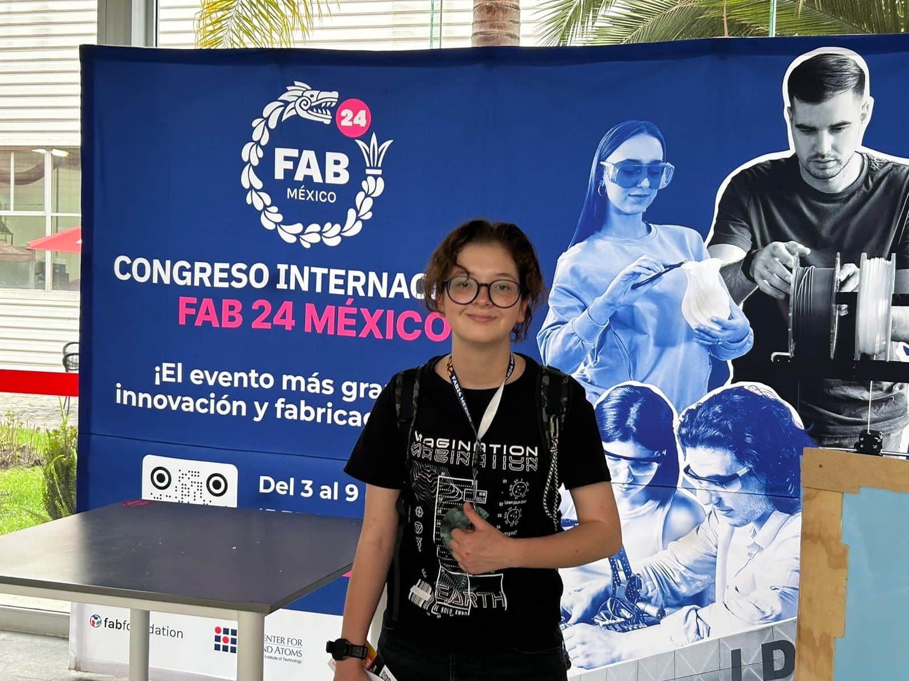

# Documentación del Proyecto de Oliver

Bienvenido 👋  
Esta es una **plantilla** basada en [MkDocs](https://www.mkdocs.org/) + [Material for MkDocs](https://squidfunk.github.io/mkdocs-material/) para cursos y proyectos.

---

## un poco mas de información




Soy marilu, actualmente soy estudiante de ingenieria en mecatronica de primer semestre, así que no he tenido mucha experiencia previamente en el campo de la fabricación digital.


Creo que una de las cosas que mas me alegra haber hecho es haber aceptado ir a un taller de ajedrez en universidad, ya que esto se derivo a que conociera el IDIT y abriera mi panorama de estudia agregando la ingenieria dejando asi a un lado el diseño grafico.

Como concecuencia fui varios dias seguidos al IDIT dinde empeze a hacer nuevas amistades, aprender lo basico como software cad o analizar circuitos electronicos.

como resultado final entre a estudiar ingenieria en mecatronica en la universidad iberoamericana puebla.

 Un dato curioso: mi avion de combate faborito es el f-18 y f-22.


 Hola me llamo Carlos soy de Tabasco y me gusta el pejelagarto :D
Soy orgullosamente fan del tottenham.estoy feliz por los amigos que hice en la prepa ya que si tal vez no sobresalí en esa etapa ellos fueron mi alegría y eso vale mas que cualquier logro.


1. **Edita el nombre del sitio** en `mkdocs.yml`:
   ```yaml
   site_name: Documentación del Curso
   theme:
     name: material
